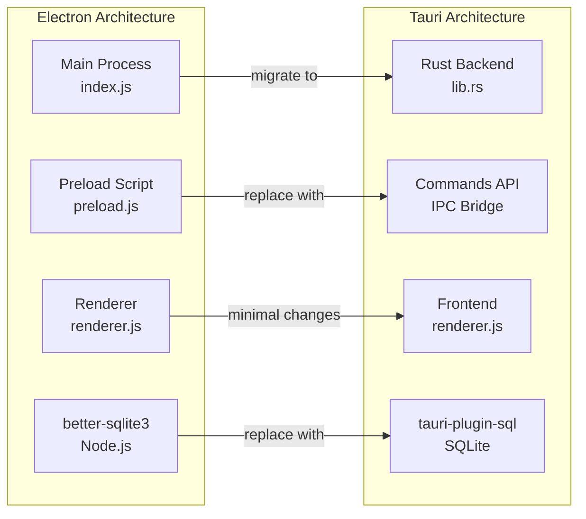

# Tauri Migration Plan

## Overview

This plan outlines the migration of PostBoy from Electron to Tauri 2.0. The new Tauri-based project has been created at `c:\Users\sarohag\source\postboy\PostBoy\PostBoy` (inside the existing postboy directory) using the official Tauri create command with Svelte template, then adapted to use vanilla HTML/CSS/JS. The project will maintain all existing functionality while passing all current tests.

## Important Notes

⚠️ **PACKAGE MANAGER**: Always use `yarn`, NEVER use `npm`. This is a project requirement.

⚠️ **FRONTEND FRAMEWORK**: Use **Svelte** as per the template created by the user. Do NOT change to vanilla JS or any other framework without explicit permission.

## Current Progress (Updated 2026-02-27)

✅ **Completed:**

- Tauri project initialized using `cargo create-tauri-app` with Svelte template
- All required Tauri plugins added to Cargo.toml (sql, dialog, updater, fs, log, shell, rusqlite)
- Database layer implemented in Rust with migrations (src-tauri/src/database/mod.rs)
- All Tauri commands implemented (src-tauri/src/commands/mod.rs)

✅ **Recently Completed:**

- Svelte template files restored (svelte.config.js, vite.config.js, tsconfig.json)
- Created Tauri API wrapper in TypeScript ($lib/api/tauri.ts)
- Created main Svelte page component (+page.svelte)
- Copied CSS and assets to static folder
- Basic PostBoy UI implemented in Svelte
- Dependencies installed with yarn
- Fixed all Rust compilation errors (borrow checker, type errors, unused variables)
- Rust backend compiling successfully

✅ **App Successfully Running!**

- Vite dev server: [http://localhost:1420/](http://localhost:1420/)
- Rust backend compiled and running
- PostBoy Tauri app launched successfully

✅ **Test Suite Migrated:**

- All test files copied from Electron version
- Converted from Playwright to WebDriver
- Test files: quick-test.js, test-api-collection.js, test-ui-components.js, test-database-schema.js, test-import-export-collections.js
- Test infrastructure ready in `PostBoy/PostBoy/tests/`
- Dependencies installed with yarn

✅ **App Status:**

- ✅ Vite dev server running on [http://localhost:1420/](http://localhost:1420/)
- ✅ Rust backend compiled successfully
- ✅ PostBoy.exe running
- ✅ Basic Svelte UI functional

🔄 **Current Focus:**

- Implementing missing features to pass all tests
- Need to enhance Svelte components for full feature parity

📋 **Testing Strategy:**

**Two-Layer Testing Approach:**

1. **Unit/Component Tests (Vitest + Svelte Testing Library)**
  - Fast component tests in isolation
  - Run: `yarn test` or `yarn test:ui`
  - Location: `src/**/*.test.ts`
2. **E2E Tests (WebDriverIO + tauri-driver)**
  - Full app integration tests
  - Run: `yarn test:e2e` or `cd tests && yarn test`
  - Location: `tests/*.js`

**Test Files Ready:**

- ✅ `tests/run-all-tests.js` - Master E2E test runner
- ✅ `tests/quick-test.js` - Quick E2E validation
- ✅ `tests/test-api-collection.js` - API E2E tests
- ✅ `tests/test-ui-components.js` - UI E2E tests
- ✅ `tests/test-database-schema.js` - Database tests
- ✅ `tests/test-import-export-collections.js` - Import/Export tests
- ✅ All test data files copied
- ✅ Vitest configured for component tests
- ✅ All linter errors fixed (jsconfig.json added)

📋 **Missing Features to Implement:**

1. Multiple request tabs with close buttons
2. All body types (JSON, XML, YAML, HTML, JS, Text, Binary, GraphQL, Form Data)
3. Auth types UI (Basic, Bearer, API Key)
4. Key-value editors with enable/disable checkboxes
5. Response viewer with headers/body tabs
6. Collections tree with nested requests
7. CURL import/parse functionality
8. Keyboard shortcuts
9. Sidebar collapse/resize
10. Export/Import modals

## Key Architecture Changes

### Electron → Tauri Mapping




### IPC Communication Changes

**Electron (current):**

- `ipcRenderer.invoke('db-create-collection', name, description)`
- Uses contextBridge in preload.js

**Tauri (new):**

- `invoke('db_create_collection', { name, description })`
- Direct Rust command invocation

## Project Structure

```
PostBoy/PostBoy/                  # Svelte + Tauri project
├── src/                          # Svelte Frontend
│   ├── routes/
│   │   ├── +layout.ts
│   │   └── +page.svelte          # Main app (to be migrated from Electron)
│   ├── lib/                      # Svelte components
│   │   ├── components/           # UI components
│   │   ├── stores/               # Svelte stores for state
│   │   └── api/                  # Tauri API wrappers
│   └── app.html                  # HTML template
├── src-tauri/                    # Rust backend
│   ├── Cargo.toml                # Includes tauri-plugin-sql, dialog, etc.
│   ├── tauri.conf.json           # Window config, plugins, build settings
│   ├── build.rs
│   ├── src/
│   │   ├── lib.rs                # Main entry with plugin setup
│   │   ├── main.rs
│   │   ├── commands/
│   │   │   └── mod.rs            # All Tauri commands
│   │   └── database/
│   │       └── mod.rs            # SQLite migrations
│   └── capabilities/
│       └── default.json          # Security permissions
├── tests/                        # Tests (to be migrated to WebDriver)
│   ├── package.json
│   └── specs/
├── package.json                  # Svelte + Tauri + plugins
├── svelte.config.js              # SvelteKit adapter-static
├── vite.config.js                # Vite dev server config
├── tsconfig.json
└── README.md
```

## Prerequisites Setup

### Step 0: Install Rust and Cargo (if not already installed)

**For Windows:**

1. **Install Visual Studio C++ Build Tools** (if not already installed)
  - You already have this from the Electron project setup
  - Required for: "Desktop development with C++" workload
  - Download: [https://visualstudio.microsoft.com/visual-cpp-build-tools/](https://visualstudio.microsoft.com/visual-cpp-build-tools/)
2. **Install Rust using rustup**
  - Download rustup-init.exe: [https://win.rustup.rs/x86_64](https://win.rustup.rs/x86_64)
  - Or direct link: [https://static.rust-lang.org/rustup/dist/x86_64-pc-windows-msvc/rustup-init.exe](https://static.rust-lang.org/rustup/dist/x86_64-pc-windows-msvc/rustup-init.exe)
  - Run the installer and follow prompts (default options are recommended)
  - Restart your terminal after installation
3. **Verify installation**

```powershell
   rustc --version    # Should show: rustc 1.x.x
   cargo --version    # Should show: cargo 1.x.x
   

```

1. **Install WebView2** (usually pre-installed on Windows 10/11)
  - Download if needed: [https://developer.microsoft.com/en-us/microsoft-edge/webview2/](https://developer.microsoft.com/en-us/microsoft-edge/webview2/)
  - Use "Evergreen Bootstrapper"
2. **Install Edge WebDriver** (for testing)

```powershell
   cargo install --git https://github.com/chippers/msedgedriver-tool
   

```

### Step 0.1: Install Tauri CLI and Prerequisites

```powershell
# Install Tauri CLI globally
cargo install tauri-cli --locked

# Or use npm (recommended for this project since you already use npm)
npm install -g @tauri-apps/cli

# Install tauri-driver for testing
cargo install tauri-driver --locked
```

## Migration Steps

### Phase 1: Project Initialization

1. **Create new Tauri project using Cargo**
  **Option A: Using cargo (as requested)**

```powershell
   # Navigate to parent directory
   cd c:\Users\sarohag\source
   
   # Create Tauri project using cargo
   cargo install create-tauri-app --locked
   cargo create-tauri-app
   # When prompted:
   # - Project name: postboy-tauri
   # - Identifier: com.moodysaroha.postboy
   # - Choose language: TypeScript / JavaScript
   # - Choose package manager: npm
   # - Choose UI template: Vanilla
   # - Choose UI flavor: JavaScript
   

```

   **Option B: Using npm (alternative)**

```powershell
   cd c:\Users\sarohag\source
   npm create tauri-app@latest
   # Follow same prompts as above
   

```

1. **Install Tauri plugins**
  Navigate to the new project and add plugins:

```powershell
   cd postboy-tauri
   
   # Add SQL plugin with SQLite support
   npm run tauri add sql
   cd src-tauri
   cargo add tauri-plugin-sql --features sqlite
   cd ..
   
   # Add other plugins
   npm run tauri add dialog
   npm run tauri add updater
   npm run tauri add fs
   npm run tauri add log
   

```

1. **Copy frontend assets**
  - Copy all files from `[src/](src/)` to new project
  - Copy `[src/index.html](src/index.html)`, `[src/index.css](src/index.css)`, `[src/loading.html](src/loading.html)`
  - Copy all JavaScript modules: renderer.js, collections.js, auth.js, modal-manager.js, renderjson.js
  - Copy assets folder with icons

### Phase 2: Backend Migration (Rust)

1. **Database Layer** (`[src/database.js](src/database.js)` → Rust)
  - Implement database manager using `tauri-plugin-sql`
  - Create schema initialization in Rust
  - Tables: collections, requests, history, settings
  - Implement migrations for schema versioning
2. **Tauri Commands** (replaces IPC handlers in `[src/index.js](src/index.js)`)
  **Collections Commands:**
  - `db_create_collection(name, description) -> i64`
  - `db_get_collections() -> Vec<Collection>`
  - `db_get_collection(id) -> Option<Collection>`
  - `db_update_collection(id, name, description) -> bool`
  - `db_delete_collection(id) -> bool`
   **Requests Commands:**
  - `db_create_request(collection_id, request_data) -> i64`
  - `db_get_requests(collection_id) -> Vec<Request>`
  - `db_get_request(id) -> Option<Request>`
  - `db_update_request(id, request_data) -> bool`
  - `db_delete_request(id) -> bool`
   **History Commands:**
  - `db_add_history(request_data, response_data) -> bool`
  - `db_get_history(limit) -> Vec<HistoryItem>`
  - `db_clear_history() -> bool`
   **Settings Commands:**
  - `db_set_setting(key, value) -> bool`
  - `db_get_setting(key, default_value) -> Value`
  - `db_get_all_settings() -> HashMap<String, Value>`
   **Import/Export Commands:**
  - `db_export_collections(collection_ids, format) -> String`
  - `db_import_collections(import_data, overwrite) -> ImportResult`
   **File Operations:**
  - `show_save_dialog(options) -> Option<String>`
  - `show_open_dialog(options) -> Option<Vec<String>>`
  - `write_file(file_path, data) -> Result<(), String>`
  - `read_file(file_path) -> Result<String, String>`
   **App Info:**
  - `get_version() -> String`
3. **Window Configuration**
  - Main window: 1400x900, min 1000x700
  - Loading window: 400x500 (frameless)
  - Dark theme background: #1a1a1a
  - Custom menu with View, Edit, Help sections
4. **Auto-updater** (`[src/updater.js](src/updater.js)` → `tauri-plugin-updater`)
  - Configure GitHub releases endpoint
  - Generate signing keys for updates
  - Implement update check on startup and hourly
  - Manual update check from Help menu

### Phase 3: Frontend Migration

1. **Remove Electron-specific code**
  - Delete `[src/preload.js](src/preload.js)` (not needed in Tauri)
  - Remove `window.electronAPI` references
2. **Update API calls** (`[src/renderer.js](src/renderer.js)`, `[src/collections.js](src/collections.js)`)
  - Replace `window.electronAPI.db.`* with `invoke('db_*', args)`
  - Replace `window.electronAPI.showSaveDialog` with `@tauri-apps/plugin-dialog`
  - Replace `window.electronAPI.writeFile` with `@tauri-apps/plugin-fs`
  - Update all IPC calls to use Tauri's invoke API
3. **Update HTML** (`[src/index.html](src/index.html)`)
  - Remove Electron CSP meta tag
  - Add Tauri API script tag or use npm package
  - Keep all existing UI structure unchanged
4. **Loading Screen** (`[src/loading.html](src/loading.html)`)
  - Convert to Tauri splash screen or initial window
  - Update version fetching to use Tauri commands

### Phase 4: Configuration

1. **tauri.conf.json**
  - Set app identifier: `com.moodysaroha.postboy`
  - Configure windows (main and loading)
  - Set up menu structure
  - Configure updater endpoints
  - Set bundle identifier and version
  - Enable required plugins
2. **Cargo.toml**
  - Add dependencies: tauri, serde, serde_json, sqlx
  - Add plugin dependencies
  - Configure features
3. **Package.json**
  - Update scripts for Tauri CLI
  - Add `@tauri-apps/api` and `@tauri-apps/cli`
  - Keep existing frontend dependencies
  - Remove Electron dependencies
4. **Capabilities & Permissions**
  - Configure SQL plugin permissions (execute, select, load, close)
  - Configure dialog plugin permissions (open, save, message)
  - Configure fs plugin permissions (read, write)
  - Configure updater plugin permissions

### Phase 5: Test Migration

The current tests use Playwright's `_electron` API which is Electron-specific. We need to migrate to WebDriver-based testing for Tauri.

1. **Install WebDriver dependencies**
  - Install `tauri-driver` globally: `cargo install tauri-driver --locked`
  - Install WebDriver client: `webdriverio` or `selenium-webdriver`
  - Install platform-specific drivers (WebKitWebDriver on Linux, Edge Driver on Windows)
2. **Migrate test files**
  **Current Playwright pattern:**

```javascript
   import { _electron as electron } from 'playwright';
   this.app = await electron.launch({ args: [path.join(__dirname, '..')] });
   this.window = app.windows()[0];
   

```

   **New WebDriver pattern:**

```javascript
   import { remote } from 'webdriverio';
   const driver = await remote({
     capabilities: {
       'tauri:options': {
         application: './src-tauri/target/release/postboy-tauri'
       }
     }
   });
   

```

1. **Update test files:**
  - `[tests/test-api-collection.js](tests/test-api-collection.js)` - Update app launch and window interaction
  - `[tests/test-ui-components.js](tests/test-ui-components.js)` - Update selectors and interactions
  - `[tests/test-database-schema.js](tests/test-database-schema.js)` - Update database path (Tauri uses different app data location)
  - `[tests/test-import-export-collections.js](tests/test-import-export-collections.js)` - Update file dialog interactions
  - `[tests/run-all-tests.js](tests/run-all-tests.js)` - Update orchestration for WebDriver
  - `[tests/quick-test.js](tests/quick-test.js)` - Update for WebDriver
2. **Database path changes**
  - Electron: `%APPDATA%/postboy/postboy.db`
  - Tauri: `%APPDATA%/com.moodysaroha.postboy/postboy.db`
  - Update test expectations accordingly
3. **Test execution**
  - Start `tauri-driver` before running tests
  - Update test scripts in package.json
  - Ensure all 7 quick tests pass
  - Ensure all full test suites pass

### Phase 6: Build & Distribution

1. **Configure bundlers**
  - Windows: MSI and NSIS installers
  - Linux: AppImage, deb, rpm
  - macOS: DMG (if needed)
2. **Update signing**
  - Generate Tauri signing keys for updates
  - Configure in tauri.conf.json
  - Update GitHub Actions workflow
3. **Icon configuration**
  - Convert/copy icons to Tauri format
  - Set in tauri.conf.json

## Critical Differences to Handle

### 1. Native Modules

- **Electron:** Uses `better-sqlite3` (Node.js native)
- **Tauri:** Uses `tauri-plugin-sql` with sqlx (Rust native)
- **Impact:** All database operations must be rewritten in Rust

### 2. File System Access

- **Electron:** Direct Node.js fs access via IPC
- **Tauri:** Scoped file system access via plugin
- **Impact:** Must configure scope permissions for file dialogs

### 3. Window Management

- **Electron:** `BrowserWindow` API in main process
- **Tauri:** Window configuration in tauri.conf.json + runtime API
- **Impact:** Loading window logic needs redesign

### 4. Context Isolation

- **Electron:** Uses preload.js with contextBridge
- **Tauri:** Built-in secure IPC, no preload needed
- **Impact:** Remove preload.js, update all API calls

### 5. Testing Framework

- **Electron:** Playwright with `_electron` API
- **Tauri:** WebDriver with tauri-driver
- **Impact:** Complete test rewrite with different API

## Test Compatibility Requirements

All existing tests must pass in the new Tauri version:

### Quick Tests (7 tests)

1. Simple GET request
2. Method dropdown functionality
3. CURL command parsing
4. Tab navigation
5. Keyboard shortcuts (Ctrl+I)
6. POST request with JSON body
7. Geocode API (internal API test)

### Full Test Suites

1. **API Collection Tests** - 60+ API scenarios from test-apis-collection.json
2. **UI Component Tests** - All dropdowns, tabs, forms, shortcuts, collections
3. **Database Schema Tests** - Schema validation, foreign keys, indexes
4. **Import/Export Tests** - Postman v2.1.0 and PostBoy format support

## Dependencies

### Rust Dependencies (Cargo.toml)

```toml
[dependencies]
tauri = "2.0"
serde = { version = "1", features = ["derive"] }
serde_json = "1"
tauri-plugin-sql = { version = "2", features = ["sqlite"] }
tauri-plugin-dialog = "2"
tauri-plugin-updater = "2"
tauri-plugin-fs = "2"
tauri-plugin-log = "2"
```

### JavaScript Dependencies (package.json)

```json
{
  "dependencies": {
    "@tauri-apps/api": "^2.0.0",
    "js-yaml": "^4.1.0"
  },
  "devDependencies": {
    "@tauri-apps/cli": "^2.0.0",
    "webdriverio": "^9.0.0",
    "chalk": "^5.6.0"
  }
}
```

## Implementation Notes

1. **Database location:** Tauri stores app data in platform-specific locations using the app identifier
2. **Menu system:** Tauri uses a different menu API - needs complete rewrite
3. **Auto-updater:** Requires signing keys generation and GitHub releases configuration
4. **File dialogs:** Use `@tauri-apps/plugin-dialog` instead of Electron's dialog
5. **Logging:** Replace `electron-log` with `tauri-plugin-log`

## Success Criteria

- ✅ All 7 quick tests pass
- ✅ All 60+ API collection tests pass
- ✅ All UI component tests pass
- ✅ Database schema validation passes
- ✅ Import/Export functionality works (Postman v2.1.0 + PostBoy format)
- ✅ Application launches and runs correctly
- ✅ Auto-updater configured and functional
- ✅ Build process creates distributable packages

## Risk Mitigation

1. **Testing compatibility:** WebDriver API differs from Playwright - may require test logic adjustments
2. **Database migration:** Users upgrading from Electron version need data migration path (out of scope for initial implementation)
3. **Performance:** Tauri is generally faster, but database operations may have different characteristics
4. **Platform-specific issues:** WebDriver support varies by platform (Windows/Linux fully supported, macOS requires community tools)

## Quick Start Commands Summary

```powershell
# 1. Install Rust (if not installed)
# Download and run: https://win.rustup.rs/x86_64

# 2. Install Tauri CLI
npm install -g @tauri-apps/cli

# 3. Install tauri-driver for testing
cargo install tauri-driver --locked

# 4. Create project
cd c:\Users\sarohag\source
cargo install create-tauri-app --locked
cargo create-tauri-app
# Select: postboy-tauri, com.moodysaroha.postboy, JavaScript, npm, Vanilla

# 5. Add plugins
cd postboy-tauri
npm run tauri add sql
npm run tauri add dialog
npm run tauri add updater
npm run tauri add fs
npm run tauri add log

# 6. Configure SQLite feature
cd src-tauri
cargo add tauri-plugin-sql --features sqlite
cd ..

# 7. Run development server
npm run tauri dev
```

## Reference Documentation

- Tauri v2 Official Docs: [https://v2.tauri.app/](https://v2.tauri.app/)
- Tauri Prerequisites: [https://v2.tauri.app/start/prerequisites/](https://v2.tauri.app/start/prerequisites/)
- Tauri SQL Plugin: [https://v2.tauri.app/plugin/sql/](https://v2.tauri.app/plugin/sql/)
- Tauri Dialog Plugin: [https://v2.tauri.app/plugin/dialog/](https://v2.tauri.app/plugin/dialog/)
- Tauri Updater Plugin: [https://v2.tauri.app/plugin/updater/](https://v2.tauri.app/plugin/updater/)
- Tauri WebDriver Testing: [https://v2.tauri.app/develop/tests/webdriver/](https://v2.tauri.app/develop/tests/webdriver/)
- Rust Installation: [https://rustup.rs/](https://rustup.rs/)

